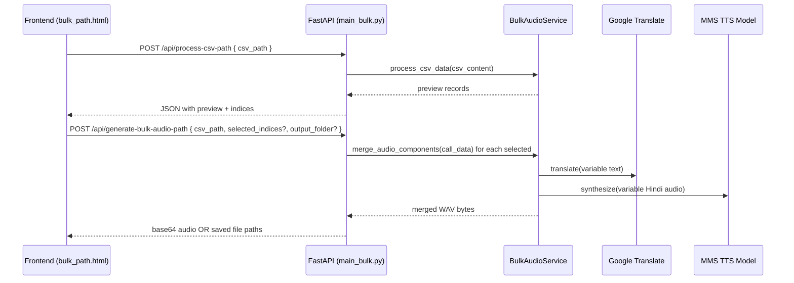

# BharatWork TTS Backend (MMS TTS + Google Translate)

FastAPI backend that translates English to Hindi and synthesizes speech using Meta’s MMS TTS Hindi model. It also includes a production-friendly bulk audio generator that reuses “master” audio templates and only synthesizes variable parts (name, company, salary, phone) before merging them.

## Highlights

- 🌐 FastAPI backend with CORS and HTML templates
- 🧠 English → Hindi translation via Google Translate (deep-translator)
- 🔊 TTS via MMS Hindi model: `facebook/mms-tts-hin` (Transformers + PyTorch)
- � Bulk audio generation using reusable master templates + dynamic inserts
- 💾 Windows-friendly in-memory audio processing (no temp-file locks)
- 🧭 Frontend for bulk processing with CSV path input and record selection

## System overview

The system uses a modular audio approach:

1) One-time master templates: Common phrases like “Hello”, “this is a call from BharatWork”, “The offered salary is”, etc. are generated once and reused.
2) Dynamic parts: For each record (name, company, salary, phone), we translate and synthesize only those parts.
3) Merge pipeline: We then merge [template → variable → template → …] into one final WAV per recipient with brief silences between segments.

### Architecture (Mermaid)

```mermaid
flowchart LR
    subgraph Frontend
        A[bulk_path.html UI]
        JS[bulk_path_script.js]
    end

    A -->|File path + selections| JS
    JS -->|POST /api/process-csv-path| B
    JS -->|POST /api/generate-bulk-audio-path| B

    subgraph Backend (FastAPI)
        B[main_bulk.py routes]
        SVC[BulkAudioService]
        TTS[GoogleTranslateMTTSService]
        CFG[config.py Settings]
    end

    B --> SVC
    B --> TTS
    SVC -->|MMS model + tokenizer| MMS[(facebook/mms-tts-hin)]
    SVC --> TSL[Audio templates + merging]
    TTS -->|deep-translator| GT[Google Translate]
```

### Bulk Generation flow (Mermaid)



## Project structure

```text
app/
  main_bulk.py          # FastAPI routes for translate + bulk-by-path flows
  config.py             # Pydantic Settings (env) for model/language/sample rate
  services/
    translation_tts_service.py  # Google Translate + MMS synthesis service
    bulk_audio_service.py       # Template generation + dynamic merging pipeline
  templates/
    index.html          # Simple demo for Translate API
    bulk_path.html      # Bulk UI: CSV path + selection + output folder
  static/
    bulk_path_script.js # JS for the bulk UI
requirements.txt        # Dependencies (FastAPI, transformers, torch, numpy/scipy, etc.)
README.md               # This documentation
```

## Setup

```bash
python -m venv .venv
# Windows PowerShell
.venv\Scripts\Activate.ps1
pip install -r requirements.txt
```

Environment variables (see `app/config.py`):

```env
# .env (all have defaults)
MMS_MODEL_NAME=facebook/mms-tts-hin
TARGET_LANGUAGE=hi
SAMPLE_RATE=16000
REQUEST_TIMEOUT_SECONDS=60.0
```

## Run

Two options:

1) Direct script with reload and banners

```bash
cd app
python main_bulk.py
```

2) Uvicorn

```bash
uvicorn app.main_bulk:app --reload --host 0.0.0.0 --port 8000
```

Open:
- Bulk UI: http://localhost:8000/bulk-path
- API docs: http://localhost:8000/docs

## Using the Bulk UI

- Step 1: Enter the CSV file path (absolute path on your machine)
- Step 2: Load CSV and select records (or Select All)
- Step 3: Optionally set Output Folder to save WAV files directly
- Step 4: Generate Audio

CSV must include columns: `name, company_name, salary, phone_number`.

Example rows:

```csv
name,company_name,salary,phone_number
Rahul Sharma,Acme Corp,₹40,000,+91-98765-43210
Priya Gupta,Innotech,₹55,000,+91-91234-56789
```

## Backend details

- Translation and TTS are decoupled:
  - `GoogleTranslateMTTSService` handles English→Hindi translation and synthesis through MMS (via Hugging Face transformers).
  - `BulkAudioService` loads/creates master templates to avoid regenerating common phrases, generates variable clips, and merges segments with short silences using NumPy/SciPy and SoundFile.
- Windows-friendly I/O: all intermediate audio is handled in memory (`io.BytesIO`), avoiding file locking issues.
- Endpoints used by the Bulk UI:
  - `POST /api/process-csv-path` — Validate CSV path, return preview with indices.
  - `POST /api/generate-bulk-audio-path` — Generate audio for selected indices; either returns base64 clips or saves WAVs to an output folder.

## API reference

### POST /api/translate

Request

```json
{ "text": "Hello Rahul, congratulations!" }
```

Response

```json
{
  "hindi_text": "नमस्ते राहुल, बधाई हो!",
  "audio_base64": "<base64-wav>",
  "audio_format": "wav"
}
```

### POST /api/process-csv-path

Request

```json
{ "csv_path": "C:\\data\\call_data.csv" }
```

Response (preview)

```json
{
  "message": "Successfully processed 2 records",
  "records": 2,
  "preview": [
    { "index": 0, "name": "Rahul Sharma", "company_name": "Acme Corp", "salary": "₹40,000", "phone_number": "+91-98765-43210" },
    { "index": 1, "name": "Priya Gupta", "company_name": "Innotech", "salary": "₹55,000", "phone_number": "+91-91234-56789" }
  ]
}
```

### POST /api/generate-bulk-audio-path

Request (selected indices + optional output folder)

```json
{
  "csv_path": "C:\\data\\call_data.csv",
  "selected_indices": [0,1],
  "output_folder": "C:\\output\\audio"
}
```

Response (when saving to disk)

```json
{
  "total_generated": 2,
  "message": "Successfully generated 2 audio files",
  "output_folder": "C:\\output\\audio",
  "saved_files": [
    { "name": "Rahul Sharma", "company_name": "Acme Corp", "file_path": "C:\\output\\audio\\Rahul_Sharma_Acme_Corp.wav" },
    { "name": "Priya Gupta", "company_name": "Innotech", "file_path": "C:\\output\\audio\\Priya_Gupta_Innotech.wav" }
  ]
}
```

Response (when returning base64)

```json
{
  "total_generated": 1,
  "message": "Successfully generated 1 audio files",
  "audio_files": [
    { "name": "Rahul Sharma", "company_name": "Acme Corp", "audio_base64": "<base64-wav>" }
  ]
}
```

## Notes & tips

- First-time run will download the MMS model; allow time and disk space.
- For best quality, ensure your Python environment has a compatible Torch build for your CPU/GPU.
- If you change `SAMPLE_RATE`, master templates will be regenerated on first use.
- CSV paths and output paths must be accessible from the server machine.

Happy building! 🇮🇳�
